<div align="center">

# InsightPilot — 智能数据分析 Agent

<h4><b>Autonomous Data Analysis Agent</b></h4>

<p>
一个基于电商问数项目改进优化的 <strong>自主数据分析 Agent</strong>：用自然语言提问，系统自动完成
理解 → 规划 → 检索 → 生成 SQL → 校验 → 执行 → 反思修正 → 自动画图 → 生成报告 的完整链路。
</p>


</div>

## 目录

- [项目介绍](#项目介绍)
- [界面预览](#界面预览)
- [核心能力](#核心能力)
- [系统架构](#系统架构)
- [分析流程](#分析流程)
- [项目结构](#项目结构)
- [下载后需要修改的配置](#下载后需要修改的配置)
- [快速开始](#快速开始)
- [API 接口](#api-接口)
- [核心机制](#核心机制)
  - [SQL 只读安全](#sql-只读安全)
  - [数据权限](#数据权限)
  - [数据源接入与实时同步](#数据源接入与实时同步)
  - [系统化评测](#系统化评测)
  - [链路追踪 / 可观测性](#链路追踪--可观测性)
  - [反馈闭环 / 在线进化](#反馈闭环--在线进化)
- [配置说明](#配置说明)
- [能力边界](#能力边界)

## 项目介绍

`InsightPilot` 是在一个[电商数仓问数项目](https://github.com/didilili/shopkeeper-agent)基础上改进优化而来的自主数据分析 Agent。原项目面向固定的电商表，以「用户提问 → 生成一条 SQL → 返回结果」的单轮模式运行；本项目针对它在分析深度、数据接入、安全可控、可观测性与持续进化上的不足，做了一轮系统性升级。

在真实问数场景里，业务同学通常不会写 SQL，分析同学也很难随时记住所有表结构、字段含义、指标口径和取值。`InsightPilot` 要解决的就是这个问题——让任何一个人都能用自然语言一句话触发完整分析，并拿到可信的结果与洞察。

### 相比电商问数项目的改进优化

| 维度 | 电商问数项目 | InsightPilot |
| ---- | ------------ | ------------ |
| 分析模式 | 单轮「提问 → 一条 SQL → 表格」 | 自主分析循环：规划、检索、生成/校验/执行、反思修正、下钻，迭代上限兜底 |
| 数据范围 | 固定电商数仓表 | 混合检索召回 + 多数据源接入（审批 + 全量快照 + binlog 实时同步） |
| 结果呈现 | 仅数据表格 | 表格 + ECharts 图表 + Markdown 分析报告 |
| 交互体验 | 一次性问答 | 登录鉴权、多轮追问、会话持久化、SSE 流式进度 |
| 安全可控 | 直接执行 SQL | SQL 只读护栏 + 表级权限，杜绝误写数仓 |
| 质量治理 | 无法度量 | 金标准评测、链路追踪、反馈闭环在线进化 |

## 界面预览

**主界面 · 多轮问数**

<p align="center">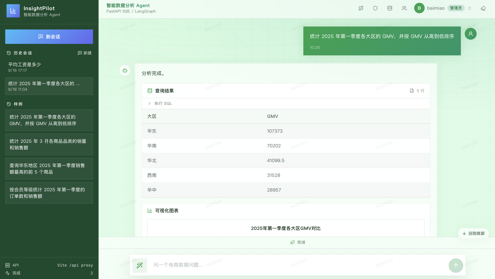</p>

**查询结果 · 表格 + 图表 + 分析报告**

<p align="center">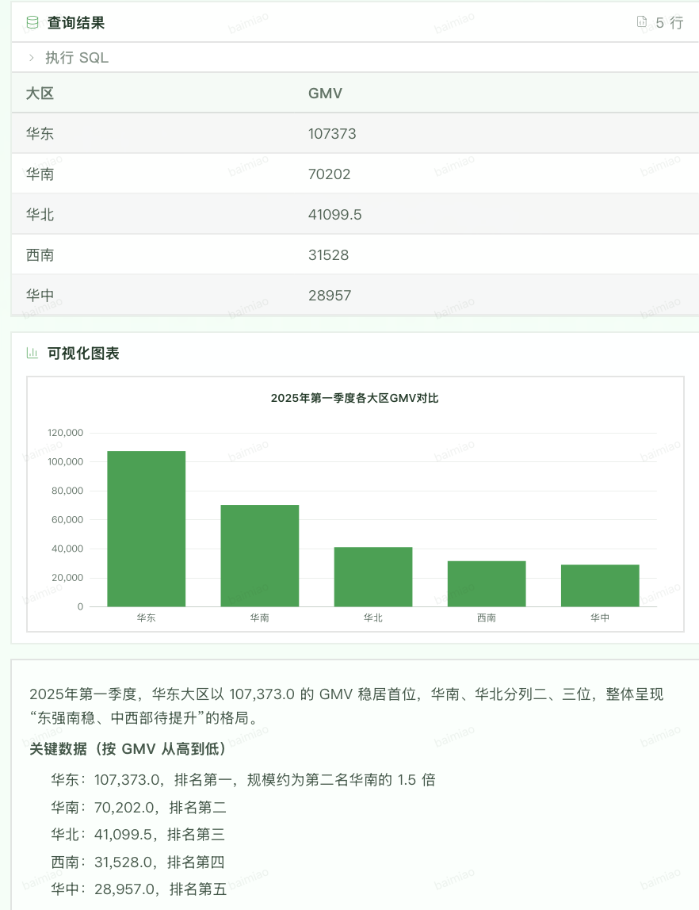</p>

**登录 / 注册**

<p align="center">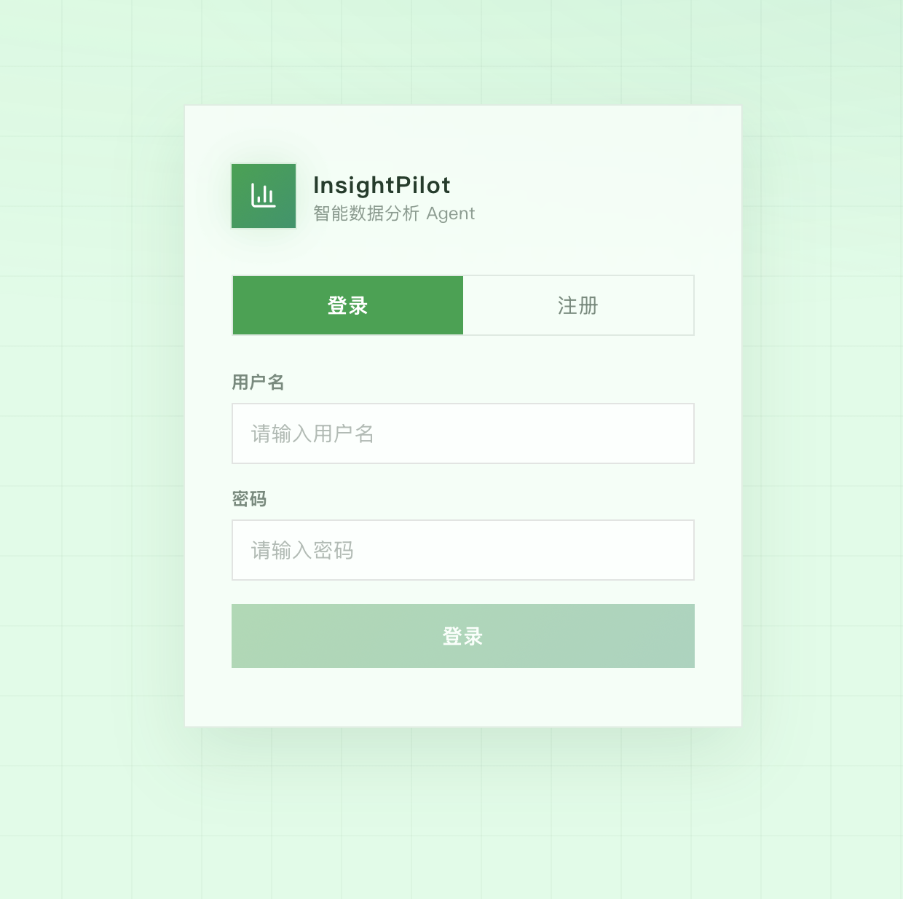</p>

**用户管理**

<p align="center">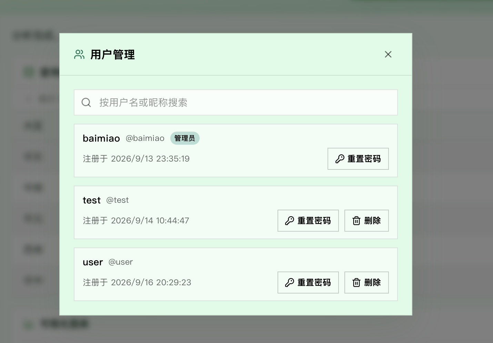</p>

## 核心能力

- **自主分析循环**：不是「问一句生成一条 SQL」的单轮模型。Agent 会先规划，执行后反思结果，自主决定「修正 SQL 重试」「推进下一个子问题」「追问用户」还是「收尾画图写报告」，并由迭代上限兜底防死循环。
- **混合检索召回**：`Qdrant` 负责字段/指标的语义召回，`Elasticsearch` 负责字段取值全文检索，`MySQL` 保存完整权威的结构化元数据，字段、指标、取值三类信息协同召回。
- **SQL 只读安全护栏**：所有生成的 SQL 在执行前经过 `assert_read_only_sql` 强制校验，只允许 `SELECT`/`WITH`，拒绝多语句、`INTO OUTFILE` 及各类写关键字，从代码层杜绝误写数仓。
- **自动画图 + 报告**：查询结束后自动产出图表规格（柱状/折线/饼图/散点），并生成引用图表占位符的 Markdown 分析报告。
- **鉴权与多轮会话**：自建账号密码 + JWT（HS256）鉴权；多会话、按用户隔离、持久化到 MySQL，下次登录可回看并继续之前的对话。
- **前后端流式联调**：FastAPI + SSE 把节点进度、结果、图表、报告实时推给 React 前端，动态渲染执行时间线。
- **多数据源接入与实时同步**：业务库经「申请 → 审批」后在一致性快照内全量镜像进自有数仓，并订阅源库 binlog 实时增量同步（行级 INSERT/UPDATE/DELETE 与 DDL 建表/改表/删表自动跟随），镜像表自动爬取元数据并生成中文语义，可直接被自然语言查询。
- **系统化评测**：内置金标准评测集，量化 SQL 正确率、召回命中率与端到端通过率，让 Agent 的可靠性可度量、可回归。
- **链路追踪 / 可观测性**：采集每次 LLM 调用的 token 与耗时、每个节点的执行跨度，落盘 `logs/traces.jsonl`，前端提供可视化面板。
- **反馈闭环 / 在线进化**：对回答可赞/踩，踩时可附上正确 SQL 纠错；纠错记录会作为 few-shot 示例注入后续 SQL 生成，让 Agent 从历史错误中持续学习。

## 系统架构

| 模块 | 技术 | 作用 |
| ---- | ---- | ---- |
| 数据仓库 `dw` | `MySQL` | 自有数仓：默认教学库 + 各数据源镜像表（`s{id}_` 前缀），分析型查询环境 |
| 元数据库 | `MySQL` / `SQLAlchemy` | 表、字段、指标、用户、会话、消息、反馈与数据源等结构化数据 |
| 向量检索 | `Qdrant` | 字段和指标向量，支持语义召回 |
| 全文检索 | `Elasticsearch` | 字段真实取值，支持关键词和值域检索 |
| Embedding | `TEI` / `BAAI/bge-large-zh-v1.5` | 将文本转成向量 |
| 智能体编排 | `LangGraph` | 组织理解规划、召回与自主分析循环工作流 |
| 模型接入 | `LangChain` | 封装 LLM 与 Embedding 调用（默认 `deepseek-chat`） |
| 后端接口 | `FastAPI` | 鉴权、问数、会话管理、反馈，依赖注入与生命周期管理 |
| 流式协议 | `SSE` | 实时返回会话、计划、进度、结果、图表和报告 |
| 鉴权 | `PyJWT` / `bcrypt` | JWT 签发校验 + 密码哈希 |
| 数据源接入 | `mysql-replication` / `pymysql` | 连接外部源库，一致性快照全量同步 + binlog 增量同步（CDC） |
| 可逆加密 | `cryptography` / `Fernet` | 数据源密码可逆加密存储，接口不回传密码或密文 |
| 前端 | `React 19` / `Vite` / `Tailwind CSS` | 深色科技风聊天界面、ECharts 图表、Markdown 报告、链路追踪面板 |
| 依赖管理 | `uv` / `pnpm` | 管理 Python 后端和前端依赖 |

### 架构示意

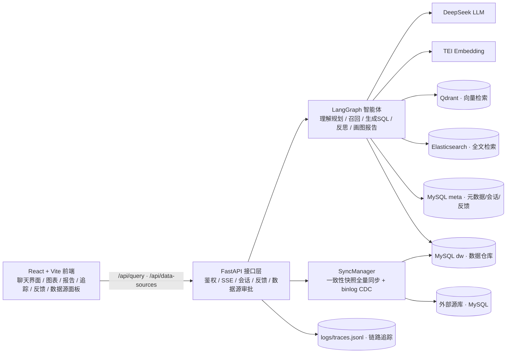

## 分析流程

LangGraph 图按以下顺序编排（[graph.py](app/agent/graph.py)）：

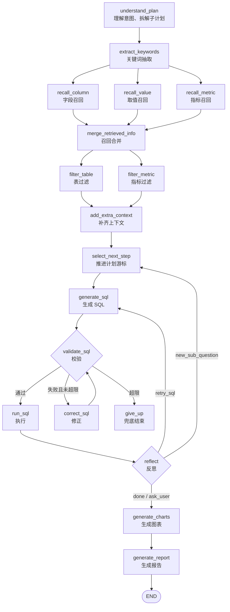

- 反思循环由 `reflection.next_action` 与配置上限 `agent.max_sql_retries`、`agent.max_analysis_loops` 共同约束，保证不会死循环。
- SQL 校验、执行、反思都会产出 `progress` 事件，前端据此动态渲染执行时间线。
- 用户历史纠错记录会在 `generate_sql` / `correct_sql` 两个节点作为 few-shot 示例注入提示词。

## 项目结构

```text
insight-pilot/
├── app/
│   ├── agent/            # LangGraph 图、状态、上下文与各节点
│   ├── api/              # FastAPI 路由、依赖注入、生命周期与请求结构
│   ├── clients/          # MySQL、Qdrant、Elasticsearch、Embedding 客户端管理与源库连接
│   ├── conf/             # 配置 dataclass 与配置加载工具
│   ├── core/             # 日志、request_id 上下文、JWT、可逆加密与 SQL 只读护栏
│   ├── entities/         # 更贴近业务语义的数据对象
│   ├── evaluation/       # 评测集用例、打分器与执行器
│   ├── models/           # SQLAlchemy ORM 模型
│   ├── observability/    # 链路追踪：token/耗时采集与 trace 落盘
│   ├── prompt/           # Prompt 加载工具
│   ├── repositories/     # MySQL、Qdrant、Elasticsearch 数据访问层
│   ├── scripts/          # 元数据知识库构建、数据源建表与评测入口脚本
│   └── services/         # 鉴权、权限、数据源接入与同步、元数据构建与问数查询服务
├── conf/                 # app_config.yaml、meta_config.yaml
├── docker/               # Docker Compose、MySQL 初始化 SQL、ES 插件、Embedding 挂载目录
├── eval/                 # 金标准评测用例集（cases.yaml）
├── frontend/             # React + Vite + Tailwind CSS 前端项目
├── prompts/              # 理解规划、SQL 生成修正、反思、画图报告与镜像表字段描述 Prompt 模板
├── main.py               # FastAPI 应用入口
└── pyproject.toml        # Python 项目依赖与工具配置
```

## 下载后需要修改的配置

克隆到本地后只有少数几个地方需要你动手，其余保持默认即可。按优先级汇总：

| 优先级 | 位置 | 配置项 | 说明 |
| ------ | ---- | ------ | ---- |
| 🔴 必改 | `.env` | `LLM_API_KEY` | 大模型 API Key。默认走 DeepSeek，去 [platform.deepseek.com](https://platform.deepseek.com) 申请 |
| 🔴 必改 | `.env` | `JWT_SECRET_KEY` | JWT 签名密钥，务必改成随机长字符串；泄露后任何人都能伪造登录态 |
| 🟡 按需 | `conf/app_config.yaml` | `db_meta.password` / `db_dw.password` | 改了 `docker/docker-compose.yaml` 里的 MySQL 密码时需同步 |
| 🟡 按需 | `conf/app_config.yaml` | `llm.model_name` / `llm.base_url` / `llm.api_key` | 换用其他模型平台时修改 |
| 🟡 按需 | `frontend/.env` | `VITE_API_BASE_URL` / `VITE_DEV_PROXY_TARGET` | 后端地址/端口不是默认值时修改 |
| 🟢 默认即可 | `docker/docker-compose.yaml` | MySQL 密码、各端口 | 本地演示用默认值即可；对外部署才需要改 |

> `.env` 已在 `.gitignore` 中，不会被提交。仓库只提供 `.env.example` 模板，克隆后 `cp .env.example .env` 再填入上面的值。

## 快速开始

### 1. 准备环境

- Python `>= 3.14`
- `uv`
- Docker 与 Docker Compose
- Node.js 与 `pnpm`

### 2. 安装后端依赖

```bash
uv sync
```

### 3. 配置环境变量

```bash
cp .env.example .env
```

编辑 `.env`，两处必改：

```bash
LLM_API_KEY=你的 DeepSeek API Key      # 🔴 必填，否则 LLM 调用会失败
JWT_SECRET_KEY=一串足够长的随机字符串     # 🔴 必改，不要用默认值
```

随机密钥可用下面的命令生成：

```bash
python -c "import secrets; print(secrets.token_hex(32))"
```

其余按默认即可；换用其他模型平台见 [配置说明](#配置说明)。

### 4. 准备 Embedding 模型

```bash
uv run hf download BAAI/bge-large-zh-v1.5 --local-dir docker/embedding/bge-large-zh-v1.5
```

### 5. 启动 Docker 基础服务

```bash
docker compose -f docker/docker-compose.yaml up -d
```

默认端口：

| 服务 | 端口 |
| ---- | ---- |
| MySQL | `3307` |
| Elasticsearch | `9200` |
| Kibana | `5601` |
| Qdrant | `6333` |
| Embedding | `8081` |

> `docker/mysql/meta.sql` 与 `docker/mysql/dw.sql` 会在 MySQL 首次启动时自动初始化元数据库和教学数仓。对已存在的元数据库，可运行 `uv run python -m app.scripts.seed_data_sources` 兜底创建 `data_source` 表（幂等，可安全重复执行）。

### 6. 构建元数据知识库

```bash
uv run python -m app.scripts.build_meta_knowledge -c conf/meta_config.yaml
```

### 7. 启动后端

```bash
uv run fastapi dev main.py
```

### 8. 启动前端

```bash
cd frontend
pnpm install
pnpm dev
```

前端默认通过 Vite 代理把 `/api` 转发到 `http://127.0.0.1:8000`。如需修改，在 `frontend/.env` 中设置 `VITE_DEV_PROXY_TARGET`。

### 9. 接入业务数据库（可选）

在「数据源」面板提交接入申请，管理员审批通过后即可把外部 MySQL 库实时镜像进来并直接问数，详见 [数据源接入与实时同步](#数据源接入与实时同步)。源库需满足以下前置条件：

- `log_bin=ON`、`binlog_format=ROW`、`binlog_row_image=FULL`；
- 同步账号具备 `REPLICATION SLAVE`、`REPLICATION CLIENT` 与对应库的 `SELECT` 权限。

## API 接口

| 方法 | 路径 | 说明 |
| ---- | ---- | ---- |
| `POST` | `/api/auth/register` | 注册并返回 JWT |
| `POST` | `/api/auth/login` | 登录并返回 JWT |
| `GET` | `/api/auth/me` | 返回当前登录用户信息 |
| `POST` | `/api/query` | 问数查询（SSE），需鉴权 |
| `GET` | `/api/sessions` | 返回当前用户的会话列表 |
| `GET` | `/api/sessions/{id}` | 返回会话详情与历史消息 |
| `GET` | `/api/sessions/{id}/traces` | 返回会话的链路追踪记录 |
| `POST` | `/api/messages/{id}/feedback` | 对一条消息提交赞/踩/纠错反馈 |
| `PATCH` | `/api/sessions/{id}` | 重命名会话 |
| `DELETE` | `/api/sessions/{id}` | 删除会话 |
| `GET` | `/api/data-sources` | 数据源列表（管理员看全部，普通用户只看自己的申请） |
| `POST` | `/api/data-sources/apply` | 提交接入数据库申请，状态置为 pending |
| `POST` | `/api/data-sources/{id}/review` | 审批申请（仅管理员；approved 触发全量同步） |
| `POST` | `/api/data-sources/{id}/resync` | 手动触发全量重同步（仅管理员） |
| `DELETE` | `/api/data-sources/{id}` | 删除数据源：停增量、删镜像表、清元数据（仅管理员） |

`/api/query` 请求体：

```json
{
    "query": "统计 2025 年第一季度各大区的 GMV，并分析原因",
    "thread_id": 12
}
```

`thread_id` 为空表示开启新会话，非空表示在既有会话里继续追问。

### SSE 事件类型

| 类型 | 含义 |
| ---- | ---- |
| `session` | 新会话建立，回传会话编号与标题 |
| `plan` | 理解规划产出的意图与子问题清单 |
| `progress` | 节点执行进度（running/success/error） |
| `result` | 结构化查询结果 `{ columns, rows }` |
| `insight` | 反思阶段产出的分析洞察 |
| `chart` | 图表规格（bar/line/pie/scatter） |
| `report` | Markdown 分析报告 |
| `message_saved` | 助手消息持久化后回传其数据库主键，供前端提交反馈 |
| `error` | 全局异常消息 |

## 核心机制

### SQL 只读安全

所有生成的 SQL 在执行前都会经过 [sql_guard.py](app/core/sql_guard.py) 的 `assert_read_only_sql` 校验：

- 仅允许 `SELECT` / `WITH` 开头的只读查询；
- 词边界拒绝 `INSERT` / `UPDATE` / `DELETE` / `DROP` 等写关键字；
- 拒绝多语句与 `INTO OUTFILE`。

该校验是唯一强制点，落在 `DWMySQLRepository.run()` 与 `validate()` 两个出口，任何一条进入数仓执行的 SQL 都绕不开它。

### 数据权限

除 SQL 只读护栏外，系统还提供表级访问控制：查询某张表前须先提交申请，管理员审批通过后方可查询；未授权时，问数链路会在执行前拦截并提示「无权访问表」，避免越权读取敏感表。

<p align="center">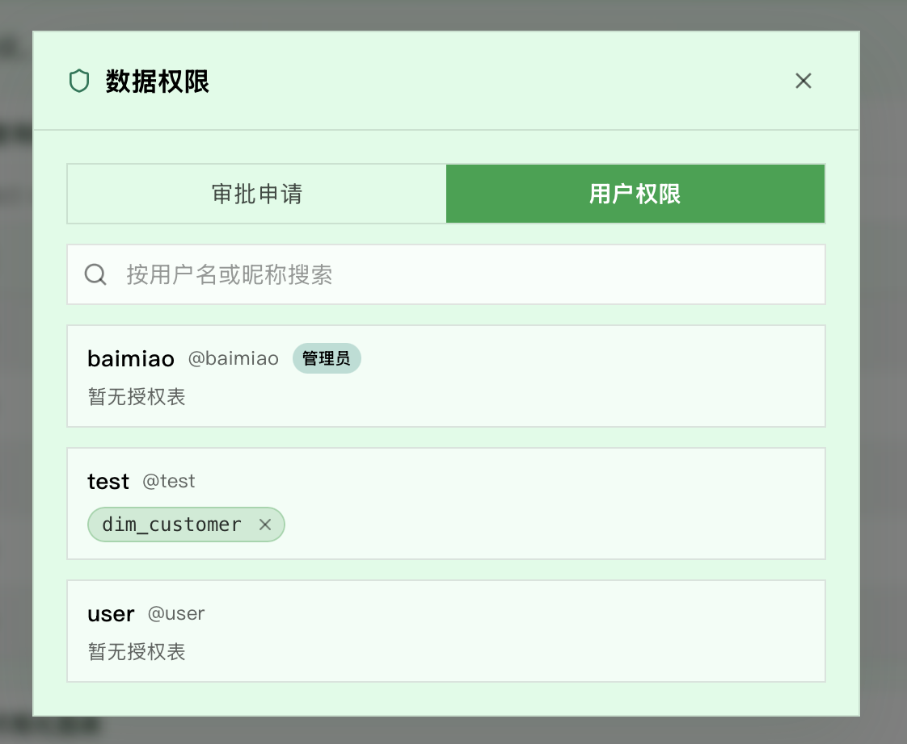</p>

<p align="center">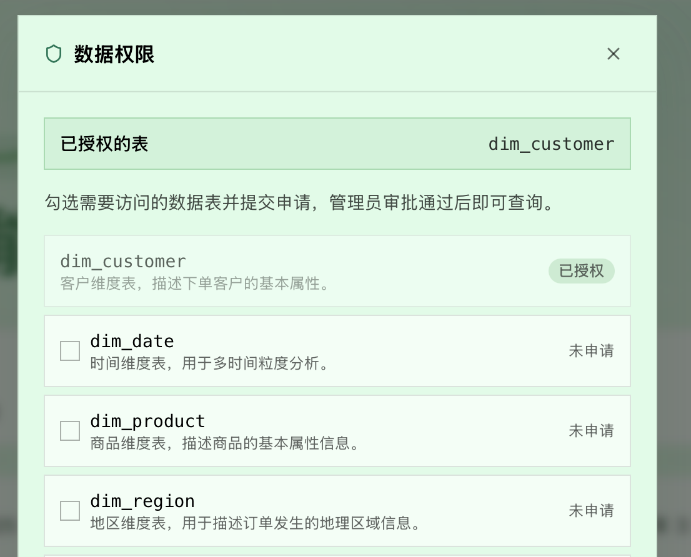</p>

<p align="center">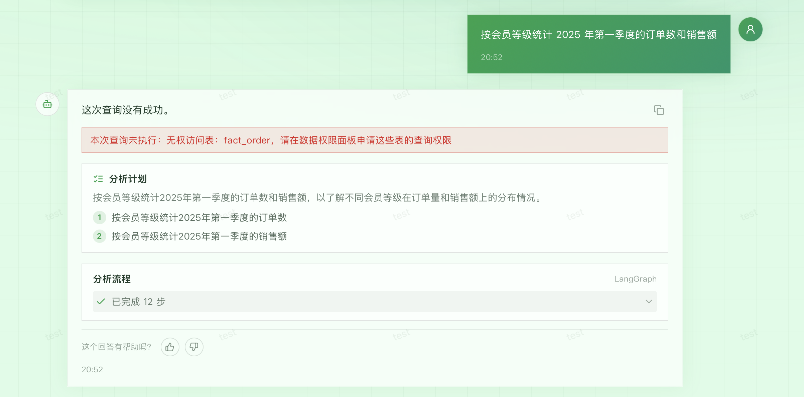</p>

### 数据源接入与实时同步

系统支持把外部 MySQL 业务库接入进来，经管理员审批后全量镜像进自有数仓 `dw`，并订阅源库 binlog 实时增量同步。数据最终都落在 `dw`，因此下游的检索、`sql_guard` 白名单、表级权限链路全部复用，镜像表就是 `dw` 里的普通表。

<p align="center">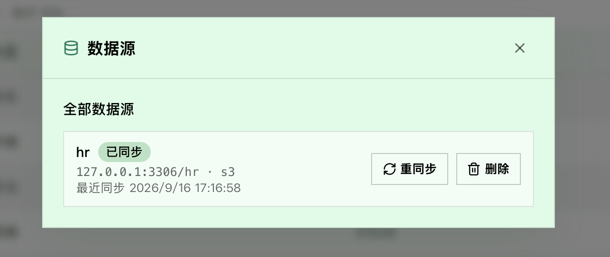</p>

<p align="center">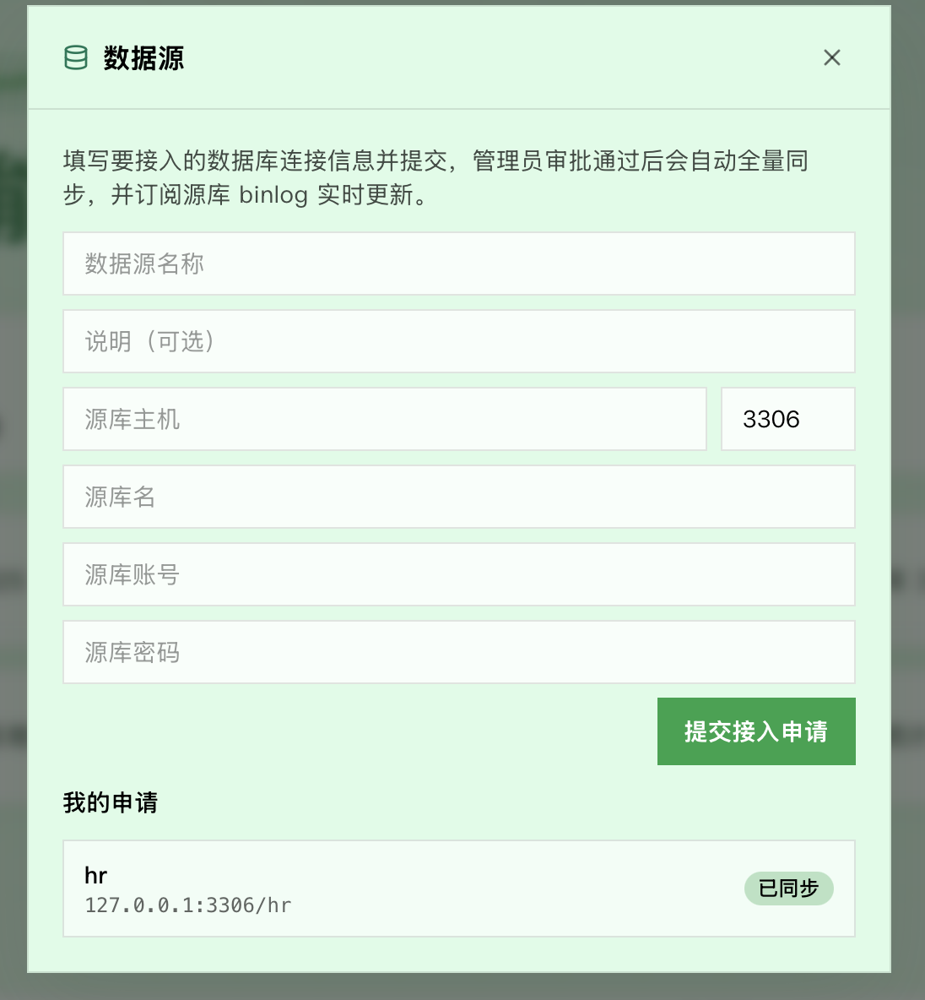</p>

**接入流程（两级审批）**

- 接入数据库 = 一级审批：普通用户在「数据源」面板提交申请（主机/端口/库名/账号/密码），管理员审批通过后触发同步；
- 表级使用 = 二级审批：镜像表落地后，复用现有 `table_permission` 申请/审批，与默认表一致。

**镜像表命名**

每个数据源一个前缀 `s{source_id}`，源表 `orders` 镜像为 `s{source_id}_orders`，表名天然唯一，`table_info.id` / `column_info.id` 直接用带前缀的名字。

**全量同步**（`app/services/sync_service.py`）

1. 置 `status=syncing`；
2. 连源库开 `REPEATABLE READ` 一致性快照，读取 `SHOW MASTER STATUS` 记录快照时点的 `(binlog_file, binlog_pos)`；
3. 逐表按 `CREATE TABLE` 生成镜像表（保留列类型/主键/索引，剔除跨表外键），按主键幂等导入数据（有唯一键 `ON DUPLICATE KEY UPDATE`，否则 `INSERT IGNORE`）；
4. 成功置 `status=active` 并写回位点与 `last_sync_at`；失败置 `status=error` 并记录 `sync_error`。

**增量同步（CDC）**（`app/services/binlog_worker.py`）

每个 active 源一个独立后台线程，用 `mysql-replication` 从保存的位点起读 binlog：

- 行事件：`WriteRows` / `UpdateRows` / `DeleteRows` 按主键幂等应用到镜像表；
- DDL：`CREATE TABLE` 自动建镜像并触发元数据爬取；`ALTER TABLE` 改写后同步；`DROP TABLE` 删镜像并清理元数据；`RENAME TABLE` 暂不支持（提示手动重同步）；
- 每批事件后把新位点写回 `data_source`，断线重连后从最后位点续传，避免漏数据。

**元数据自动爬取**

镜像表字段名来自源表 DDL（多为英文/拼音），没有手写中文语义。全量同步成功或捕获到新建表后，自动调用 `MetaKnowledgeService.sync_mirror_tables` 爬取表/字段元数据，并由 LLM 根据「表名 + 字段类型 + 示例值」生成字段中文描述与别名（`prompts/describe_mirror_columns.prompt`），写入 `meta` 与 Qdrant，让中文自然语言问题在向量召回阶段能命中镜像表。

**密码安全**

源库密码使用 Fernet 可逆加密存储（密钥由 JWT 密钥派生），连接源库时解密还原；任何接口都不回传密码或密文。可逆方案意味着应用本身能读到明文（连接所必需），生产环境应改用 KMS / Secret Manager。

**状态机**

`pending` → 审批 `approved` → `syncing` → `active`；任意同步失败置 `error`；`rejected` / `disabled` 为终态。应用启动时自动恢复所有 `active` 源的增量同步。

**源库前置条件**

- `log_bin=ON`、`binlog_format=ROW`、`binlog_row_image=FULL`；
- 同步账号具备 `REPLICATION SLAVE`、`REPLICATION CLIENT` 与对应库的 `SELECT` 权限。

### 系统化评测

项目内置一套金标准评测集，围绕三个维度量化 Agent 的可靠性（`app/evaluation/` + `eval/cases.yaml`）：

- **SQL 正确率**：生成 SQL 与金标准 SQL 的执行结果对拍是否一致（与列名、列顺序无关，并做浮点规整）；
- **召回命中率**：金标准答案所需的关键字段/指标中，被 Qdrant/ES 召回链路命中的比例；
- **端到端通过率**：链路是否正常走完并产出报告与结果。

评测依赖完整服务栈（MySQL/Qdrant/ES/Embedding/LLM），启动 docker 基础服务后执行：

```bash
uv run python -m app.scripts.evaluate -c eval/cases.yaml
# 只跑部分用例
uv run python -m app.scripts.evaluate -c eval/cases.yaml --ids q01,q03
# 只跑前 5 条
uv run python -m app.scripts.evaluate -c eval/cases.yaml --limit 5
```

评测结束会打印 Markdown 汇总表，并把完整结果写入 `eval/results.json` 与 `eval/results.md`。

新增用例：在 `eval/cases.yaml` 里按现有格式加一条 `question` + `golden_sql` + `expect_columns`/`expect_metrics` 即可，跑分脚本会自动纳入统计。

### 链路追踪 / 可观测性

自建轻量 Tracer（`app/observability/`），通过 LangChain callback 捕获每次 LLM 调用的 token 消耗与耗时，配合进度事件统计每个节点的执行耗时，最终把一次问数结构化落盘到 `logs/traces.jsonl`（一行一条）：

- **节点时间线**：每个节点（理解规划 / 召回 / 生成 SQL / 执行 / 反思 / 画图 / 报告等）的起止与耗时；
- **LLM 明细**：每次调用的模型、prompt/completion token、耗时与估算成本（按 deepseek-chat 官方价估算）；
- **自主循环诊断**：SQL 历史（含失败重试的中间 SQL）、SQL 重试次数、反思轮数、最终动作。

每次查询结束都会打印一行汇总日志，例如：

```text
链路追踪 abc123…：2840 tokens、7 次 LLM 调用、耗时 6.2s
```

通过 API 读取某个会话的全部 trace：

```bash
curl -H "Authorization: Bearer $TOKEN" http://127.0.0.1:8000/api/sessions/12/traces
```

或直接查看原始文件：

```bash
tail -f logs/traces.jsonl
```

前端会话页顶栏的「链路追踪」按钮会打开右侧抽屉，逐条 trace 可视化节点时间线、LLM token/成本明细与 SQL 历史。

<p align="center">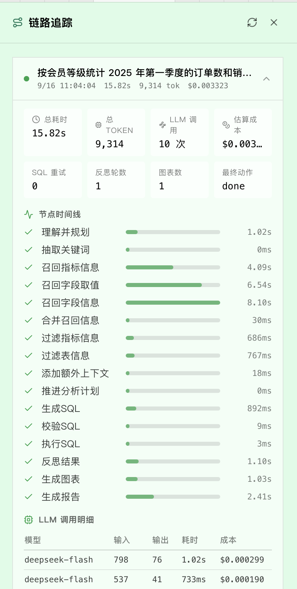</p>

> 成本估算中的单价为 [tracer.py](app/observability/tracer.py) 里写死的 deepseek-chat 定价常量，换模型后需同步调整。

### 反馈闭环 / 在线进化

Agent 的回答下方提供赞/踩与纠错入口，形成「用户反馈 → 纠错示例 → few-shot 注入 → 生成更准」的在线进化闭环：

- **赞 / 踩**：对每条回答快速打分，落库到 `chat_feedback` 表；
- **纠错**：踩时可以附上「补充说明」和「正确的 SQL」，作为高质量 few-shot 样本；
- **在线注入**：每次问数前，后端读取最近 5 条带正确 SQL 的纠错记录，把「问题 → 错误 SQL → 纠正后 SQL」注入到 SQL 生成/校正提示词，让模型在相似场景下参考纠正后的口径，避免重复犯同样的错。

接口示例：

```bash
curl -X POST -H "Authorization: Bearer $TOKEN" \
  -H "Content-Type: application/json" \
  -d '{"kind":"correct","comment":"GMV 需排除已退款订单","corrected_sql":"SELECT ..."}' \
  http://127.0.0.1:8000/api/messages/12/feedback
```

> 反馈表 `chat_feedback` 已加入 `docker/mysql/meta.sql`；老库需手动执行建表语句。表未建好时问数链路会自动退化为不使用 few-shot，不影响主流程。

## 配置说明

主要配置集中在 `conf/app_config.yaml`：

| 配置项 | 说明 | 是否需要修改 |
| ------ | ---- | ------------ |
| `llm` | 默认 `deepseek-chat`，可替换为任意兼容 OpenAI 接口的模型平台 | 🟡 换模型平台时 |
| `jwt` | JWT 密钥（读自 `.env`）、算法（HS256）与过期时间 | 🔴 密钥在 `.env` 里必改 |
| `agent` | 反思循环上限：`max_sql_retries`、`max_analysis_loops` | 🟢 默认即可 |
| `db_meta` / `db_dw` | 元数据库与数仓连接信息 | 🟡 改数据库密码时 |
| `qdrant` / `es` / `embedding` | 向量库、全文检索与 Embedding 服务地址 | 🟢 默认即可 |

> 本项目的元数据口径配置在 `conf/meta_config.yaml`，包含指标（如 GMV、AOV）与事实表/维度表的关联字段定义。数据源接入的连接信息（主机/端口/库名/账号/加密密码）保存在 `meta.data_source` 表，不在配置文件中维护。

## 能力边界

本项目聚焦「自主数据分析」的核心链路，暂不覆盖生产治理能力，例如：行级数据权限、多租户隔离、查询缓存与限流、报告质量的 LLM-as-judge 评测、监控告警与灰度发布。数据源接入目前仅支持 MySQL 源库与常见 DDL（`CREATE/ALTER/DROP TABLE`），跨异构数据源（PostgreSQL、Oracle 等）、`RENAME TABLE` 自动同步、复杂 schema 漂移处理与密码托管（KMS）尚待扩展。
